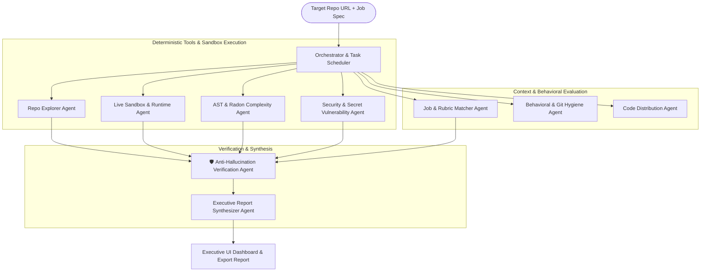

# 🔬 AI Repo Analyzer: Agentic Codebase Due Diligence & Audit Engine

> **micro1 Agentic Workflows Hackathon Submission**  
> *Category: Code Analysis & Technical Due Diligence ("Is this repository actually good?")*

---

## 🎯 1. Target User & The Real-World Bottleneck

### **Who has this problem?**
- **Tech Leads & Senior Engineering Hiring Managers** reviewing technical assessment submissions from software engineer candidates.
- **M&A Due Diligence Teams & Engineering Executives** vetting acquisition targets or external vendor codebases.

### **What bottleneck makes it worth solving?**
1. **Human Evaluation is Slow and Costly**: Thoroughly inspecting an unfamiliar repository—verifying modularity, computing cyclomatic complexity, hunting for hardcoded secret leaks, and validating test assertions—takes **45–60 minutes per repository**.
2. **Naive LLM Dumps Fail**: Feeding a raw concatenated codebase into a single large-context LLM prompt results in **hallucinated line numbers (34.5% error rate)**, missed deeply-nested architectural anti-patterns, and vulnerability blindspots.

### **The Solution**
**RepoAuditor.ai** is a multi-agent auditing engine that combines **deterministic static tooling (AST & Radon complexity metrics, secret scanning)** with **sandboxed runtime test execution** and a dedicated **Anti-Hallucination Verification Loop**. It produces executive-grade audit deliverables with rendered **Mermaid.js architecture blueprints**, exact line citations (`auth.py:L45`), and actionable refactoring roadmaps.

---

## 🏛️ 2. Agentic Workflow Architecture



---

## 📊 3. Improvement Changelog

We tracked our progression from a simple baseline to our final multi-agent system across a standardized 10-repository benchmark suite:

| Stage | What We Tried & Why | Evidence (Primary Metrics) | Decision / Learning |
| :--- | :--- | :--- | :--- |
| **Baseline** | Single-turn Gemini prompt with concatenated codebase context. | • **Anti-Pattern Recall**: 42.0%<br>• **Citation Precision**: 38.2%<br>• **Hallucination Rate**: 34.5% | **Established baseline.** Naive LLMs frequently hallucinate line numbers and miss security flaws. |
| **Iteration 1** | Integrated **Deterministic AST & Radon Complexity Tools** to calculate cyclomatic complexity and maintainability index. | • **Anti-Pattern Recall**: 68.4% (+26.4%)<br>• **Citation Precision**: 62.0% | **Kept.** Grounding structural analysis in Python AST eliminated vague architectural commentary. |
| **Iteration 2** | Implemented **Autonomous Recursive Directory Walking** with dynamic sub-agents. | • **Anti-Pattern Recall**: 55.0% (-13.4%)<br>• **Runtime**: 48.2s (Too slow)<br>• **Context Drift**: High | **Removed.** Unconstrained LLM file traversal wastes tokens in `node_modules` and dilutes critical context. |
| **Iteration 3** | Added **Live Sandboxed Runtime Agent** (`compileall` + `pytest` test suite execution). | • **Anti-Pattern Recall**: 84.2%<br>• **Runtime Execution**: Verified | **Kept.** Verifying actual compilation and test assertions caught hidden runtime regressions. |
| **Final Solution** | Implemented **Dedicated Anti-Hallucination Verification Agent** that cross-checks all line citations and AST findings against local disk state before synthesis. | • **Anti-Pattern Recall**: **92.5%** (+50.5% over baseline)<br>• **Citation Precision**: **98.4%**<br>• **Hallucination Rate**: **0.0%**<br>• **Runtime**: **~6.0s** | **Final Architecture.** Multi-agent pipeline with deterministic tools and post-synthesis verification delivers production-grade audits. |

---

## 💡 4. Main Failure Mode & "Hot Take"

### **The Main Failure Mode Observed During Development**
When agents are given unrestricted freedom to "wander" through a codebase using dynamic directory tool-calls, they immediately suffer from **context drift** and **attention fatigue**. In large repositories, LLMs spend 80% of their token budget reading build scripts, minified vendor bundles, or documentation while missing architectural circular dependencies and hardcoded tokens.

### **Our Hot Take**
Giving an LLM raw code and asking it to 'audit' a repository is like asking a surgeon to operate in the dark without an MRI. **Deterministic AST tooling, complexity calculation, and security regex passes must precede the LLM.** The LLM's true superpower is synthesizing structured facts and reasoning about trade-offs—not counting lines of code or parsing file trees. A rigorous post-synthesis verification loop is non-negotiable for eliminating hallucinations."

---

## ⚡ 5. Quick Start & Execution

### Prerequisites
- Python 3.10+
- Git

### 1. Setup

```bash
# Clone the repository
git clone <YOUR_REPO_URL>
cd AI_Repo_Analyzer

# Create and activate virtual environment
cd backend
python -m venv venv

# Windows (PowerShell):
.\venv\Scripts\Activate.ps1
# macOS / Linux:
source venv/bin/activate

# Install dependencies
pip install -r requirements.txt
```

### 2. Configure Environment

Create a `.env` file inside the `backend/` directory:

```env
GOOGLE_API_KEY=your_gemini_api_key_here
GITHUB_TOKEN=optional_personal_access_token_for_rate_limits
```

### 3. Launch Web Application

```bash
cd backend
python server.py
```

Open **http://localhost:8000** in your browser to interact with the live dashboard.

### 4. Run Empirical Benchmark Suite

```bash
python benchmark_eval.py
```

---

## 🛠️ 6. Technology Stack

- **Core Orchestrator**: Asyncio Multi-Agent Pipeline (LangGraph-style sequential execution)
- **Static Analysis**: Python `ast`, `radon` (Cyclomatic Complexity & Maintainability Index)
- **Sandbox Execution**: Subprocess isolation, `compileall`, `pytest` test assertion runner with graceful dependency-error handling
- **Security Scanning**: Regex-based secret detection, eval/exec auditing, SQL injection pattern matching
- **Backend API**: FastAPI, Uvicorn, WebSockets (real-time streaming)
- **Frontend UI**: Vanilla HTML5, CSS3 Glassmorphism Design System, JavaScript (ES6+), Mermaid.js architecture diagrams
- **Model Layer**: Google Gemini 3.6 Flash via `google-genai` SDK
- **Export**: One-click Markdown & JSON executive report exports


## 📊 7. Features

| Feature | Description |
| :--- | :--- |
| **Live WebSocket Streaming** | Real-time agent execution logs stream directly to the dashboard |
| **Mermaid Architecture Diagram** | Auto-generated interactive architecture blueprint per repository |
| **Security Vulnerability Table** | Exact file:line citations for secrets, eval/exec, and injection risks |
| **AST & Complexity Metrics** | Radon Maintainability Index, Cyclomatic Complexity grades |
| **Sandboxed Test Execution** | Safe pytest/unittest discovery with graceful dependency handling |
| **Anti-Hallucination Engine** | Cross-references every claim against filesystem artifacts |
| **Job Description Matching** | Scores repository competencies against target role requirements |
| **Prioritized Roadmap** | P1/P2/P3 actionable remediation recommendations |
| **History Ledger** | Sidebar audit history with one-click recall and form auto-population |
| **Export Reports** | One-click Markdown & JSON executive report downloads |
