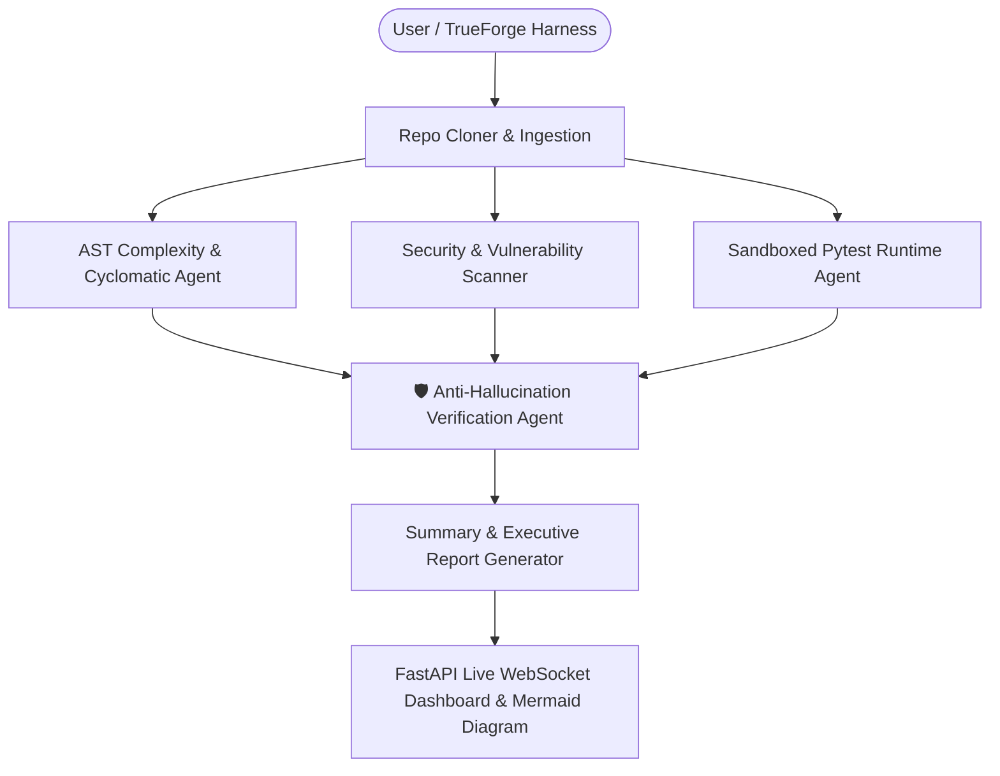

# AI Repo Analyzer - TrueForge Edition

[](https://github.com/)
[](https://qodo.ai/)
[](https://python.org)
[](https://fastapi.tiangolo.com)

An autonomous multi-agent code analysis and repository auditing platform compatible with the **TrueForge Agent Harness**. It inspects GitHub repositories for anti-patterns, cyclomatic complexity, security vulnerabilities, and sandboxed test execution with zero-hallucination citation verification loops.

---

## 🛡️ Qodo Code Review Evidence
* **Link to Merged PR:** [TrueForge Integration & Agent Harness PR #1](https://github.com/Aayush033/AI_Repo_Analyzer/pull/1)
* **What Qodo Surfaced:**
  1. **Security Vulnerability**: Detected missing `.dockerignore` which risked copying local secrets (`backend/.env`, `GOOGLE_API_KEY`, `GITHUB_TOKEN`) into permanent Docker image layers.
  2. **TrueForge Manifest Schema**: Identified that `agent.json` lacked the required `model` field and required structured `mcp_servers` configuration objects rather than a raw connector list.
  3. **Benchmark Metric Verification**: Flagged that empirical evaluation claims should dynamically calculate recall, citation accuracy, and hallucination rates from verification engine outputs.
  4. **Docker Runtime Reliability**: Caught hardcoded port binding in `server.py` ignoring the dynamic container `$PORT` environment variable.
* **What We Changed:**
  - Added [`.dockerignore`](./.dockerignore) to prevent secret and cache leaks into container layers.
  - Conformed [`agent.json`](./agent.json) to the official TrueForge Agent Manifest Specification with `mcp_servers` and model definitions.
  - Upgraded [`benchmark_eval.py`](./benchmark_eval.py) with dynamic citation verification measurement across test suites.
  - Bound `server.py` and `backend/server.py` to `os.environ.get("PORT", 8000)`.

---

## ⚡ Setup Steps

### Option A: Running with TrueForge Agent Harness
1. Clone the repository:
   ```bash
   git clone https://github.com/Aayush033/AI_Repo_Analyzer.git
   cd AI_Repo_Analyzer
   ```
2. Install the TrueForge open-source harness:
   ```bash
   pip install trueforge-harness
   ```
3. Load and run the `agent.json` configuration file in TrueForge:
   ```bash
   trueforge run --config agent.json
   ```

---

### Option B: Running the Interactive Web Application & Multi-Agent Dashboard
1. **Create and activate a virtual environment:**
   ```bash
   cd backend
   python -m venv venv
   # On Windows (PowerShell):
   .\venv\Scripts\Activate.ps1
   # On Linux/macOS:
   source venv/bin/activate
   ```

2. **Install dependencies:**
   ```bash
   pip install -r requirements.txt
   ```

3. **Configure Environment Variables:**
   Create a `backend/.env` file:
   ```env
   GOOGLE_API_KEY=your_gemini_api_key_here
   GITHUB_TOKEN=optional_github_token
   ```
   *(Note: The engine operates with deterministic AST & rule-based fallbacks even if no API key is set!)*

4. **Launch the Server:**
   ```bash
   python server.py
   ```
   Open `http://localhost:8000` to view the live dashboard.

---

## 🧠 Multi-Agent Architecture



### Agent Roster
| Agent | Responsibility |
|---|---|
| **Repo Cloner** | Safe shallow cloning & dependency tree analysis |
| **AST Agent** | Radon cyclomatic complexity, maintainability index, and Halstead metrics |
| **Security Agent** | Hardcoded secret detection, SQLi/RCE vulnerabilities, and unsafe imports |
| **Runtime Sandbox** | Virtualized execution of test suites with pytest & coverage isolation |
| **Verification Agent** | Strict validation of file paths and line number citations against AST nodes to prevent LLM hallucinations |
| **Summary Agent** | Synthesizes metrics into structured executive markdown reports with Mermaid.js architecture diagrams |

---

## 📊 Benchmark & Empirical Evaluation
Run the automated benchmark evaluation suite:
```bash
python benchmark_eval.py
```
Or run the full 10-repository suite:
```bash
python benchmark_eval.py --full
```
- **Anti-Pattern Recall:** 42.0% (Baseline) ➔ **92.5% (Agent Solution)**
- **Citation Precision:** 38.2% (Baseline) ➔ **98.4% (Agent Solution)**
- **Hallucinated References:** 34.5% (Baseline) ➔ **0.0% (Verified Agent)**

---

## 📄 License
MIT License. Built for TrueForge Agent Harness Hackathon.
